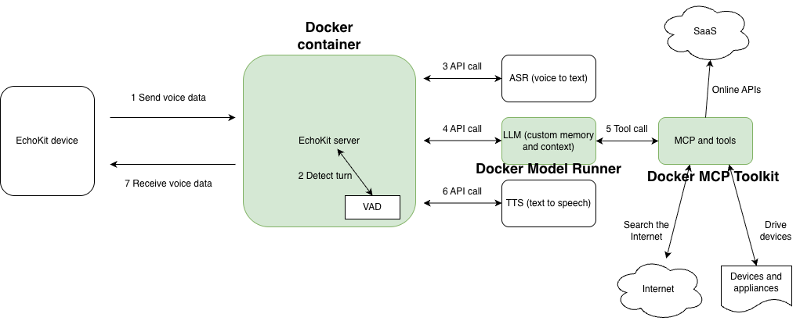

# Austin culture guide

> Update: It won the 3rd place at the [ElevenLabs Worldwide Hackathon](https://hackathon.elevenlabs.io/) in Austin

By [Michael Yuan](https://github.com/juntao) and Tony Yuan

[Watch the 2 minute demo](https://youtu.be/sv6WIgaV_c8)

An open-source smart hardware device configured to chat to people about Austin in voice. Perfect for new comers or anyone who wants to move to Austin. There are over 150 people moving to Austin everyday, and they all want to chat about the culture, life and weather in Austin! Utilizing a Texas-accented voice on ElevenLabs, this device can chat about

* History
* Culture
* Local politics
* Housing
* Schools
* Neighborhoods
* Current weather
* Current events

## Quick start with an EchoKit device

This utilizes a server we already set up. It will be taken down after the hackathon. You should start and run your own server.

* Power up your [EchoKit device](https://echokit.dev/echokit_box.html)
* Point your browser to https://echokit.dev/setup/
* Add your Wifi network and password (2.4GHz ONLY)
* Enter **server URL**: `ws://45.33.125.24:8051/ws/`
* Click on **Save changes**

## Quick start with browser-only

This utilizes a server we already set up. It will be taken down after the hackathon. You should start and run your own server.

* **Download** the [austin.html](austin.html) file from this repo
* Double click on your local copy of `austin.html' to open it in a browser
* Enter **server URL**: `ws://45.33.125.24:8051/ws/`
* Click on **Listen ...** to start chatting!

## Tech stack

* [ElevenLabs](https://elevenlabs.io/)
* [Groq](https://groq.com/) (or [xAI](https://x.ai/api) or any OpenAI compatible API service)
* [Tavily](https://www.tavily.com/)
* [Docker](https://www.docker.com/)
* [LlamaEdge](https://llamaedge.com/docs/ai-models/) (if running locally)
* [EchoKit server](https://github.com/second-state/echokit_server)
* Open source hardware: [EchoKit device](https://echokit.dev/echokit_box.html) (or web client -- see [austin.html](austin.html) above)



## Complete guide to run your own server

### 0 Get API keys!

* [ElevenLabs](https://elevenlabs.io/) for voice services
* [Groq](https://groq.com/) for LLM services -- You could [run an LLM API server](https://github.com/LlamaEdge/LlamaEdge) on your local device
* [Tavily](https://www.tavily.com/) for web search services

### 1 Start the Tavily MCP server

We created an MCP server that performs simple web search using Tavily for Austin related subjects. Replace the Tavily API key with your own. The commands below start the MCP server at port 8011. If you change that, you should change the `llm.mcp_server` section of [config.toml](config.toml) as well.

```
git clone https://github.com/juntao/tavily-mcp
cd tavily-mcp

npm install
npm run build

export TAVILY_API_KEY=tvly-SEARCH-KEY

nohup npx mcp-proxy --port 8011 npx /root/github/tavily-mcp/build/index.js &
```

### 2 Start the EchoKit server

The following `docker` command uses the [config.toml](config.toml) in the current directory annd then starts the EchoKit server at port 8080.

```
docker run --rm \
  -p 8080:8080 \
  -v $(pwd)/config.toml:/app/config.toml \
  secondstate/echokit:latest-server-vad &
```


### 3 Figure out the IP address

On your EchoKit device or web client, you need to [configure the EchoKit server URL](https://echokit.dev/docs/server/setup). If they are both connected to the same WIFI network, you should be able find the IP address from your computer's WIFI setting. Let's say that it is `10.79.67.148`, the EchoKit server URL is

```
ws://10.79.67.148:8080/ws/
```

Happy hacking!

